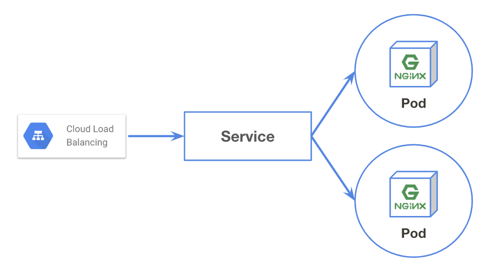

## Ingressとは
ロードバランサとしての機能を提供するObjectです。

Ingressは（L7）ロードバランサとしての機能を持ち、受け付けたトラフィックをServiceへルーティングします。  
GKEの場合マネージドロードバランサであるGoogle Cloud Load Balancer（以降GCLB）との連携を簡単に行えるので、今回はGCLBの使用を前提とします

## 作成する
（IngressはCLIからの作成に対応していないため、）Manifestを用意します。  
`ingress.yaml` というファイルを作成しましょう。

```console
$ vi ingress.yaml
```

```yaml
# 2台のnginxを立ち上げるDeployment
apiVersion: apps/v1
kind: Deployment

metadata:
  labels:
    app: mynginx
  name: mynginx

spec:
  replicas: 2
  selector:
    matchLabels:
      app: mynginx
  template:
    metadata:
      labels:
        app: mynginx
    spec:
      containers:
      - image: nginx:latest
        name: mynginx
        ports:
        - containerPort: 80

---
# "mynginx"という名前のtype: NodePortのServiceを作成
apiVersion: v1
kind: Service

metadata:
  labels:
    app: mynginx
  name: mynginx

spec:
  ports:
  - port: 80
    protocol: TCP
    targetPort: 80
  selector:
    app: mynginx
  type: NodePort

---
# "mynginx" Serviceへトラフィックを振り分けるロードバランサを作成
apiVersion: extensions/v1beta1
kind: Ingress

metadata:
  name: mynginx

spec:
  backend:
    serviceName: mynginx
    servicePort: 80
```

```console
$ kubectl apply -f ingress.yaml
```

## 確認してみる
Podが配置されていることを確認しましょう
```console
$ kubectl get all
NAME                           READY   STATUS    RESTARTS   AGE
pod/mynginx-5c7cb97c48-gkcn7   1/1     Running   0          3m21s
pod/mynginx-5c7cb97c48-wmlx4   1/1     Running   0          3m22s

NAME                 TYPE        CLUSTER-IP   EXTERNAL-IP   PORT(S)        AGE
service/kubernetes   ClusterIP   10.4.0.1     <none>        443/TCP        65m
service/mynginx      NodePort    10.4.5.246   <none>        80:32347/TCP   40m

NAME                      DESIRED   CURRENT   UP-TO-DATE   AVAILABLE   AGE
deployment.apps/mynginx   2         2         2            2           40m

NAME                                 DESIRED   CURRENT   READY   AGE
replicaset.apps/mynginx-5c7cb97c48   2         2         2       3m22s
```

Ingressは `kubectl get ingress` で取得することができます。
```console
$ kubectl get ingress
NAME      HOSTS   ADDRESS        PORTS   AGE
mynginx   *       <YOUR ADDRESS> 80      41m
```

ADDRESSへ表示されたIPへ接続して、nginxが起動していることを確認しましょう。

## お片付け
```console
$ kubectl delete -f ingress.yaml
```


## 参考
- [Ingress - Kubernetes](https://kubernetes.io/docs/concepts/services-networking/ingress/)
