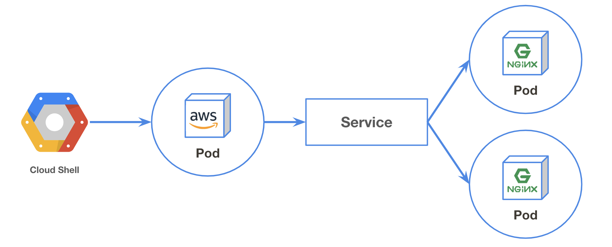

## Serviceとは
Serviceはサービスディスカバリを提供するObjectです。

サービスディスカバリとは、例えばフロントエンドからバックエンドのサービスに接続したいとき、フロントエンドはバックエンドサービスのエンドポイントを知る必要があります。  

PodにはPrivate IP が付与されますが、（以下のように）Podは新規作成/削除されると動的にIPが変わります  
```console
$ kubectl create deploy myapp --image nginx
deployment.apps/myapp created
$ kubectl get pod -o wide
NAME                   READY   STATUS    RESTARTS   AGE   IP          NODE                                                NOMINATED NODE
myapp-ddb58c99-ldw8t   1/1     Running   0          17s   10.0.2.15   gke-standard-cluster-1-default-pool-0423aa15-rbfv   <none>
$ kubectl delete pod myapp-ddb58c99-ldw8t
pod "myapp-ddb58c99-ldw8t" deleted
$ kubectl get pod -o wide
NAME                   READY   STATUS    RESTARTS   AGE   IP          NODE                                                NOMINATED NODE
myapp-ddb58c99-gxs65   1/1     Running   0          10s   10.0.2.16   gke-standard-cluster-1-default-pool-0423aa15-rbfv   <none>
$ kubectl delete deploy myapp
```

KubernetesはこういったPod間の疎通の手段として **Service** というObjectを用意しています。  
Serviceを使用することでPodへの固定されたエンドポイントを提供してくれます。

このドキュメントは「手を動かして入門する」ことをテーマとしているため、まずは実際にServiceを作成してみましょう

## Serviceを作成する


実際にServiceを作成し、そのエンドポイントに対してアクセスしてみましょう

まずはnginxを使用してDeploymentを作成します。
```console
$ kubectl create deploy mynginx --image nginx
deployment.apps/mynginx created
```

作成したnginxのPodに対してServiceを作成し、エンドポイントを作成します。
```console
$ kubectl expose deployment mynginx --port=80 --target-port=80
service/mynginx exposed
```

これでServiceの作成は完了です。  
Serviceが作成され、エンドポイント(CLUSTER-IP)が作成されているか確認しましょう。
```console
$ kubectl get service
NAME         TYPE        CLUSTER-IP     EXTERNAL-IP   PORT(S)   AGE
kubernetes   ClusterIP   10.3.240.1     <none>        443/TCP   2d10h
mynginx      ClusterIP   10.3.255.103   <none>        80/TCP    27s
```

Pod間の疎通が可能か確認します。  
クラスタ内にAmazonLinuxイメージを使用してPodを立ち上げ、作成されたエンドポイント("CLUSTER-IP")へアクセスしてみましょう。
```console
$ kubectl run --rm --restart Never --image amazonlinux:2 -it -- sh
If you don't see a command prompt, try pressing enter.
# curl <CLUSTER-IP>:80
<!DOCTYPE html>
<html>
<head>
<title>Welcome to nginx!</title>
  :
# exit
```

Serviceは作成時にDNSが自動的に割り当てられます。  
今回は"mynginx"と命名をしたので、"mynginx.default.svc.cluster.local"が割り当てられます。
```console
$ kubectl run --rm --restart Never --image amazonlinux:2 -it -- sh
If you don't see a command prompt, try pressing enter.
# yum install -y bind-utils
  :
# dig mynginx.default.svc.cluster.local
  :
;; ANSWER SECTION:
mynginx.default.svc.cluster.local. 30 IN A      10.3.255.103
  :
```

curlもしてみましょう。
```console
# curl mynginx.default.svc.cluster.local:80
<!DOCTYPE html>
<html>
<head>
<title>Welcome to nginx!</title>
  :
# exit
```

!!! note "DNSの命名規則"
    DNSは以下の通りの命名規則で割り当てられます。  
    `<Service名>.<Namespace名>.svc.cluster.local`  
    Service名は `kubectl expose` で指定した名前になります。  
    Namespaceは環境（本番やステージングなど）を分ける際に使用します。何も指定しない場合は"default"という名前の環境が使用されます。  
    また、同一Namespace内であればService名だけでアクセスすることも可能です。 e.g. `curl mynginx:80`

## おまけ
### Podの更新
PodのIPが変わっても同一のエンドポイントでアクセスできるか確認します。  

既存のPodのIPを確認します。
```console
$ kubectl get pods -o wide
NAME                       READY   STATUS    RESTARTS   AGE   IP          NODE                                                NOMINATED NODE
mynginx-784f9847d4-nf9ns   1/1     Running   0          36s   10.0.2.26   gke-standard-cluster-1-default-pool-0423aa15-rbfv   <none>
```

Serviceのエンドポイントへアクセスしてみます。
```console
$ kubectl run amazonlinux2 --rm --restart Never --image amazonlinux:2 -it -- curl -I mynginx.default.svc.cluster.local:80
HTTP/1.1 200 OK
Server: nginx/1.17.1
Date: Fri, 12 Jul 2019 17:21:41 GMT
Content-Type: text/html
Content-Length: 612
Last-Modified: Tue, 25 Jun 2019 12:19:45 GMT
Connection: keep-alive
ETag: "5d121161-264"
Accept-Ranges: bytes

pod "amazonlinux2" deleted
```

次に、Podに付与されたIPを直接叩いてみましょう。
```console
$ kubectl run amazonlinux2 --rm --restart Never --image amazonlinux:2 -it -- curl -I 10.0.2.26:80
HTTP/1.1 200 OK
Server: nginx/1.17.1
Date: Fri, 12 Jul 2019 17:24:40 GMT
Content-Type: text/html
Content-Length: 612
Last-Modified: Tue, 25 Jun 2019 12:19:45 GMT
Connection: keep-alive
ETag: "5d121161-264"
Accept-Ranges: bytes

pod "amazonlinux2" deleted
```

Podを削除してみましょう。  
IPが更新されるはずです。
```console
$ kubectl get pods -o wide
NAME                       READY   STATUS    RESTARTS   AGE   IP          NODE                                                NOMINATED NODE
mynginx-784f9847d4-nf9ns   1/1     Running   0          36s   10.0.2.26   gke-standard-cluster-1-default-pool-0423aa15-rbfv   <none>
$ kubectl delete pod mynginx-784f9847d4-nf9ns
pod "mynginx-784f9847d4-nf9ns" deleted
$ kubectl get pods -o wide
NAME                       READY   STATUS    RESTARTS   AGE   IP          NODE                                                NOMINATED NODE
mynginx-784f9847d4-czbsm   1/1     Running   0          5s    10.0.2.50   gke-standard-cluster-1-default-pool-0423aa15-rbfv   <none>
```

```console
$ kubectl run amazonlinux2 --rm --restart Never --image amazonlinux:2 -it -- curl -I mynginx.default.svc.cluster.local:80
HTTP/1.1 200 OK
Server: nginx/1.17.1
Date: Fri, 12 Jul 2019 17:36:50 GMT
Content-Type: text/html
Content-Length: 612
Last-Modified: Tue, 25 Jun 2019 12:19:45 GMT
Connection: keep-alive
ETag: "5d121161-264"
Accept-Ranges: bytes

pod "amazonlinux2" deleted
```

### Podのスケールアウト


Serviceは複数のPodを紐付けることが可能です。  
先ほど作成したnginxのDeploymentを2台にスケールアウトして、アクセスログを確認してみましょう。

```console
$ kubectl scale --replicas=2 deployment mynginx
deployment.extensions/mynginx scaled
$ kubectl get pods
NAME                       READY   STATUS    RESTARTS   AGE
mynginx-784f9847d4-2kg9f   1/1     Running   0          12s
mynginx-784f9847d4-czbsm   1/1     Running   0          11m
```

何度かcurlを打ってからPodのログを確認してみましょう
```console
$ kubectl run amazonlinux2 --rm --restart Never --image amazonlinux:2 -it -- curl -I mynginx.default.svc.cluster.local
  :
  :
  :
$ kubectl get pods
NAME                       READY   STATUS    RESTARTS   AGE
mynginx-784f9847d4-2kg9f   1/1     Running   0          18m
mynginx-784f9847d4-czbsm   1/1     Running   0          30m
$ kubectl logs mynginx-784f9847d4-2kg9f
10.0.2.56 - - [12/Jul/2019:17:39:15 +0000] "GET / HTTP/1.1" 200 612 "-" "curl/7.61.1" "-"
10.0.2.56 - - [12/Jul/2019:17:39:39 +0000] "GET / HTTP/1.1" 200 612 "-" "curl/7.61.1" "-"
10.0.2.59 - - [12/Jul/2019:17:44:55 +0000] "HEAD / HTTP/1.1" 200 0 "-" "curl/7.61.1" "-"
10.0.2.61 - - [12/Jul/2019:17:45:19 +0000] "HEAD / HTTP/1.1" 200 0 "-" "curl/7.61.1" "-"
10.0.2.65 - - [12/Jul/2019:17:51:15 +0000] "HEAD / HTTP/1.1" 200 0 "-" "curl/7.61.1" "-"
10.0.2.69 - - [12/Jul/2019:17:51:25 +0000] "HEAD / HTTP/1.1" 200 0 "-" "curl/7.61.1" "-"
$ kubectl logs mynginx-784f9847d4-czbsm
10.0.2.53 - - [12/Jul/2019:17:36:50 +0000] "HEAD / HTTP/1.1" 200 0 "-" "curl/7.61.1" "-"
10.0.2.63 - - [12/Jul/2019:17:51:11 +0000] "HEAD / HTTP/1.1" 200 0 "-" "curl/7.61.1" "-"
10.0.2.67 - - [12/Jul/2019:17:51:19 +0000] "HEAD / HTTP/1.1" 200 0 "-" "curl/7.61.1" "-"
10.0.2.71 - - [12/Jul/2019:17:51:35 +0000] "HEAD / HTTP/1.1" 200 0 "-" "curl/7.61.1" "-"
```

## お片付け
Serviceの削除
```console
$ kubectl delete service mynginx
```

Deploymentの削除
```console
$ kubectl delete deployment mynginx
```

## 参照
- [Service - Kubernetes](https://kubernetes.io/docs/concepts/services-networking/service/)
- [Kubernetesの Service についてまとめてみた - Qiita](https://qiita.com/kouares/items/94a073baed9dffe86ea0)
- [Service  |  Kubernetes Engine Documentation  |  Google Cloud](https://cloud.google.com/kubernetes-engine/docs/concepts/service)
